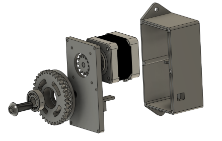
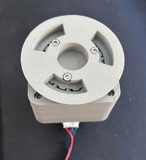

# Automatic Blind Opener Project
This project consists of the planning, design, build, and testing of an automatic blind opener. 

The design is an adaptation of the following project: https://www.the-diy-life.com/arduino-automatic-blind-opener-works-with-a-remote-control-alexa/.

Customizations were applied to fit the requirements of my particular blinds and window layout.

The blind opener is voice-controlled via the use of a universal RF hub and an Alexa puck.

## Blind Opener Project Sheet
Required items:
Part Name	                        Supplier	      Cost ($)       Comments
1Nm Stepper Motor -> Nema 23
0.4Nm Stepper Motor -> Nema 17	        Ebay	              15	     Sized down to a smaller stepper motor for size, weight, and cost benefits. Incorporated gear design to compensate for power loss.
Stepper Motor driver (5 pack)	        Ebay	              10.50	
Infrared sensor with remote	        Ebay	              7.50	     Had to purchase a second sensor as I shorted the first.
2.1 DC Input power module	        Jaycar	              3	
Pro Micro Arduino Board	                Ebay	              15	
Smart Infrared Remote	                Ebay	              20	
Capacitor	                        Jaycar		
Resistor	                        Jaycar
Bearings

### Gear Design
As calculated, the torque required to turn the blinds from a closed -> open position requires:
0.735Nm
To minimize size, cost, and weight, I chose a 0.4Nm holding torque stepper motor which has an active torque of 0.34Nm. Rounding this down to ensure tolerance, we assume the stepper has a torque of 0.3 Nm. To counter this loss in force, I implemented a gear design to increase output torque. The input gear will have 13 teeth to the output gear which will have 36 teeth. This equates to a torque multiplication of:
$36/13 = 2.76$ approx.
Meaning I will receive an output torque of:
$2.76 * 0.3 = 0.828Nm$.
Which should suffice in moving the roller blinds in both directions without the need for a counterweight.

The larger output gear will be 3D printed with a beaded circular component in which the thread of the roller blind will wrap around. This set will be rotated around a standard 22x7x8 bearing on a M8 screw-acting shaft.

### Blind Opener Case Design
The blind opener would be designed to be compact and subtle. The encloser would house the Nema17 stepper motor as well as the control electronics. It would have openings for the power supply, the USB-C port for the microcontroller as well as the RF sensor. The lid, base, and motor would be joined with M3 screws. Small shelves would be designed to hold the Arduino board and the motor driver board. Below is the first assembly design of the blind opener. 
Torque Insufficiencies
With the above design, the torque was adequate to close the blinds however was unable to open them. The force and friction of the gears impact the output of force and therefore more torque is required. After acquiring a 3D printer of my own, I was able to research and experiment with various gearboxes to maximize torque output without altering the hardware I had already purchased.

  
  
  <em>Figure 1 & 2: Blind Opener V1 CAD Assembly</em>

### Planetary Gearbox 3.7:1
Utilizing the plethora of designs available online through the 3-D printing community, I began experimenting with planetary gearboxes to increase my output torque. I began by printing: https://www.printables.com/model/281222-nema17-planetary-gearbox which utilized hardware I already had and would theoretically increase my torque by 3.7 times. After printing and installing the gearbox, a similar issue was found where the output was still too low to open the blinds. 

  
  
  <em>Figure 3 & 4: Gearbox solution #1</em>

### Planetary Gearbox 25:1
After another failed design, I looked to overcompensate on the torque aspect and found an online design that amplified the torque by a ratio of 25:1 (https://www.printables.com/model/136854-25-1-ratio-planetary-gearbox-for-nema-17-stepper ). After purchasing some additional fasteners, I printed and assembled the gearbox for testing. Initial tests proved to be promising as the blinds were able to be opened however due to the lack of friction with the chain beads on the output spool, the chain would jump and skip output rotations. Additionally, the way the gearbox was designed, the front spool was attached to a bearing that simply clicked into the front face of the gearbox. To successfully pull the blinds open, the tension of the chain had to be quite taught which would cause the bearing to slip out of the frame.

  
  
  <em>Figure 3 & 4: Gearbox solution #2</em>

### Spool Design
The initial design of the spool mimicked the size of the blind’s chain mechanism. I measured the dimensions of the beaded chain and implemented a similar pattern into a spool on Fusion 360 (Figure 3). This was advantageous for initial testing however due to the skipping of beads under high load (blind opening), I sought to improve the design. I began by increasing the size of the spool as well as the distance between the bead housings within my design. This is because I noticed that when the rope was taught, the beads would not sit properly in their grooves. This improved traction however skipping was still frequent. I then turned to the design of the blind itself and replicated the box-like pattern (Figure 5). This way, the beads would simply get caught instead of having to fit a groove.

  
  <em>Figure 5: Final spool solution</em>

### Final Build
After constructing the spool and attaching it to the gearbox and motor, the final step was to design a case to enclose the electronics. The case was fitted with 4 holes for wall mounting and a few additional holes for wire management. The electronics fit inside as seen in Figure 6. The final construction can be seen in Figure 7 and Figure 8.

  
  <em>Figure 6: Electronics enclosed within casing</em>

  
  

<em>Figure 7 & 8: Final build completed</em>

## Video Demonstration

https://github.com/mzak8780/auto-blind-opener/assets/50131251/77a8361b-64e1-4853-98c4-8377ad70cdca

